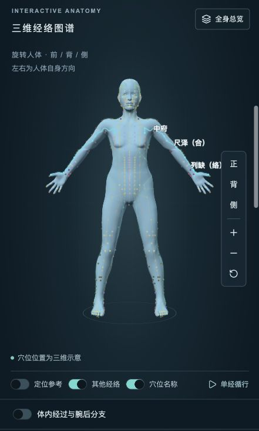

# Meridian Atlas

**Explore meridians in 3D. Connect a point, a verse, a source, and a moment in the traditional daily cycle.**

[中文](README.md) · [AGPL-3.0](LICENSE) · [Contributing](CONTRIBUTING.md)

Meridian Atlas is a Chinese-first, interactive learning application for traditional Chinese meridian theory. Rotate a human model, highlight a channel, inspect acupoints, read classical mnemonics with pinyin, explore traditional two-hour periods, and compare point groups from literature.



## What you can explore

- **12 primary meridians, 8 extraordinary vessels, and 15 luo vessels.** Separate catalogs, source passages, connecting points, and regional route illustrations.
- **419 learning records:** 362 meridian-point records following GB/T 12346-2021, 51 standardized extra-point records, and 6 supplemental records. Bilateral markers and grouped sites do not inflate this count. Differences from the WHO 361-point system are documented.
- **Interactive 3D anatomy:** drag to rotate, zoom, front/back/side/reset controls, channel highlighting, optional labels and reference guides, and disambiguation menus for overlapping targets.
- **Contextual point details:** an overview before entering the corresponding meridian; location facts, traditional indication summaries, roles and source links once selected.
- **Five Shu, Yuan and Luo roles**, including multiple roles assigned to one point.
- **Search** by Chinese name, channel, identifier and aliases. Point groups can be shared through links such as `/?points=LU7,LI4`.
- **Classical mnemonics above the model**, visual point-by-point recitation, and explicit notes on differences between historical verses and modern point catalogs.
- **Pronunciation lookup:** pinyin for characters, point names and verses; 413 standardized names carry source-indexed readings. Optional browser/system speech assists reading.
- **Daily-cycle learning:** per-channel animation, a 24-hour slider, two-hour period selection, playback and cross-midnight handling.
- **Internal courses and branches:** regional illustrations alongside selected passages from the *Lingshu*, distinct from the surface point sequence.
- **Point-combination studies:** documented traditional combinations, host–guest Yuan–Luo relations and four pairs of extraordinary-vessel confluent points, with links back to the 3D comparison view.
- **Source-aware data:** modern standards, classical texts and contemporary health information are presented separately.
- **Optional WebMCP controls** for the current page. Ordinary UI operation does not require WebMCP support.

No account or external AI API key is required. The runtime dataset and CC0 body model are included. The interface is currently Chinese; this README provides an English introduction.

## Run locally

Use Node.js 24+ and a modern WebGL-capable browser.

```bash
git clone https://github.com/galaxy-hzy/meridian-atlas.git
cd meridian-atlas
npm ci
npm run dev -- --host 127.0.0.1 --port 4318
```

Visit http://localhost:4318/. Routes: `/`, `/clock`, `/combinations`, `/sources`.

```bash
npm run typecheck
npm test
npm run lint
npm run build
npm start -- --ip 127.0.0.1 --port 4319
```

The last command starts a local production preview. No hosted public demo is claimed. Dependency installation, external reference links and some system voices may require network access. Python is only needed for optional research and data-processing scripts.

The first public version includes 156 automated tests, alongside separately performed browser interaction checks. See [development notes](docs/DEVELOPMENT.md) and [data provenance](docs/DATA.md).

## Scope and limitations

This is an educational visualization, **not a clinically validated point-location system**. Per-point anatomical calibration remains incomplete. Regional curves and body-surface projections are illustrations; traditional circulation animation is not a simulation of blood vessels, blood flow or measurable energy. Traditional indications and literature combinations are not individual treatment recommendations. The application does not provide needling instructions.

The project is in maintenance. Reproducible bug reports, source-supported corrections, accessibility improvements and anatomy reviews tied to the retained model are welcome. Please read [CONTRIBUTING.md](CONTRIBUTING.md).

If this helps you learn or teach, a **Star** helps others discover it. Corrections with a source and a reproducible example are equally valuable.

## License

Original project code and copyrightable original contributions: **GNU AGPL-3.0-only**, copyright galaxy-hzy and contributors. Distribution of derivative versions and network interaction with modified versions carry the applicable corresponding-source obligations. Private use alone does not require public release; commercial use is allowed subject to the license.

Third-party dependencies keep their licenses. The MakeHuman model remains CC0-1.0. Public-domain passages, source facts and third-party materials are not relicensed by this repository. See [LICENSE](LICENSE) and [THIRD_PARTY_NOTICES.md](THIRD_PARTY_NOTICES.md).
