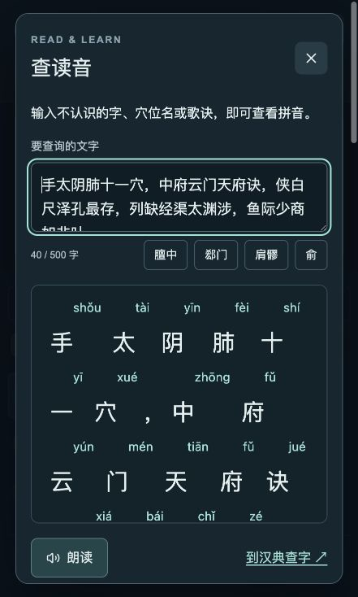

<div align="center">

# 经络图谱 · Meridian Atlas

### 把经络从书页里展开，在三维人体上边看、边读、边记。

An interactive 3D atlas for learning meridians, acupoints and classical Chinese medicine.

**十二正经 · 奇经八脉 · 十五络脉 · 419 条穴位学习记录**

[](LICENSE)
[](#快速开始)
[](https://www.typescriptlang.org/)
[](https://github.com/galaxy-hzy/meridian-atlas/actions/workflows/ci.yml)

中文 · [English](README.en.md) · [快速开始](#快速开始) · [功能详解](#功能详解) · [参与共建](CONTRIBUTING.md)

</div>

读到“中府云门天府诀”，能不能直接看到这些穴位在人体上的关系？学到“寅时肺经”，能不能沿着发亮的经线看它如何运行？遇到“髎、郄、荥”，能不能随手查读音？

**Meridian Atlas 是一个中文优先的交互式经络学习空间。** 它把可旋转的人体、经络点选、穴位分类、古籍歌诀、注音、传统时辰与配穴文献放进同一个应用。适合自主学习、课堂演示，以及开放的中医知识可视化研究。

无需账号或外部 AI API 密钥。源码、应用数据、人体模型和测试随仓库提供，可在自己的电脑运行。

<table>
<tr><th>在人体上探索经络</th><th>遇到生字，直接查读音</th></tr>
<tr><td></td><td></td></tr>
</table>

*截图来自运行中的应用。三维位置与循行属于学习示意；逐穴解剖校准尚未完成。*

## 快速开始

需要 **Node.js 24 或以上版本**、npm，以及支持 WebGL 的现代浏览器。Python 仅用于可选的数据处理与研究脚本，日常运行不需要。

```bash
git clone https://github.com/galaxy-hzy/meridian-atlas.git
cd meridian-atlas
npm ci
npm run dev -- --host 127.0.0.1 --port 4318
```

打开 **http://localhost:4318/**。

| 页面 | 地址 |
| --- | --- |
| 三维图谱 | `/` |
| 十二时辰 | `/clock` |
| 配穴研习 | `/combinations` |
| 来源与校订说明 | `/sources` |

构建并在本地预览生产版本：

```bash
npm run build
npm start -- --ip 127.0.0.1 --port 4319
```

打开 http://localhost:4319/。这是本地预览命令；仓库公开不等于已提供托管在线演示。运行时不需要配置 AI API 密钥或 Cloudflare 账号，首次安装依赖需要联网。外部参考链接和系统语音服务可能需要网络。

手机使用：在手机浏览器打开自己部署的 HTTPS 地址，可从浏览器菜单选择“添加到主屏幕”（支持情况取决于浏览器）。这仍是网页应用，不是已上架应用商店的原生 App；当前不提供离线保证或收费会员。

## 先试这条学习路线

1. 打开 **手太阴肺经**，在图谱上旋转、放大人体，观察中府到少商的体表穴序。
2. 阅读图谱上方的歌诀，点击 **歌诀注音**；开启 **逐穴带读**，跟着高亮记忆穴序。
3. 在 **五输 · 原 · 络** 中点选太渊，查看它同时属于“输、原”的分类与定位出处。
4. 打开 **体内经过与分支**，对照《灵枢》的起点、属络及分支说明。
5. 切到 **十二时辰**，选择寅时或播放全天，观察传统时辰与十二经的对应。
6. 进入 **配穴研习**，把一组文献中的穴位带回三维图谱对照。

## 功能详解

### 1. 可以操作的三维经络图谱

- **旋转、缩放、复位**：拖动人体、滚轮缩放，也可使用正面、背面、侧面和缩放按钮。
- **点经络即高亮**：从经线或目录选择，集中观察当前经络；其他经络、穴名和定位参考可分别开关。
- **两层穴位信息**：未选所属经络时显示简介；进入该经络学习后，查看定位要点、传统主治摘要、分类和原文链接。
- **重叠点选有候选项**：遇到重叠经线或穴点，可在菜单中选定目标，支持键盘选择和 Esc 取消。
- **标签自动避让**：按角度与空间隐藏部分标签，减少画面拥挤；目录仍可查找并选择穴位。
- **跨经穴组对照**：配穴链接可以一次带入多个穴位，支持 `/?points=LU7,LI4` 这样的可分享地址。

### 2. 十二正经、奇经八脉与十五络脉

| 内容 | 已实现的学习方式 |
| --- | --- |
| 十二正经 | 手足三阴三阳，经穴目录、表里关系、前后经切换、体表线路、体内区域及分支示意 |
| 奇经八脉 | 任、督、冲、带、阴跷、阳跷、阴维、阳维；文献关联穴、分段路线与八脉交会穴 |
| 十五络脉 | 十二经之络、任脉络、督脉络、脾之大络；络穴、原文、记忆提要及区域联系示意 |
| 经外奇穴 | 51 个国标条目与 6 个补充条目，可分别筛选，保留别名和穴组关系 |

任督脉与十二正经合为十四经，本项目按 **GB/T 12346-2021 收录 362 个经穴条目**；另有 **51 个国标奇穴和 6 个补充条目**，共 **419 条记录**。穴组与双侧显示不重复计数。WHO 361 穴体系、印堂新旧归属等差异另作说明。

其余六条奇经复用文献关联穴，不制造独立标准穴位编号。十五络也复用已有络穴，不另造时辰配属。

### 3. 穴位名称、分类与来源一起学

- 全局搜索中文穴名、经络名、编号和别名；例如用“消渴”查找相关补充资料，用“胰俞”检索胃脘下俞。
- 五输穴 **井、荥、输、经、合**，加上 **原、络** 分类筛选；同穴多重分类合并保留。
- 显示现代标准的定位要点、条款号与 PDF 页码，可跳转核对原文。
- 传统主治以文献摘要呈现，并区分扫描核对、转录与二次资料等出处。
- 在详情中保留模型定位依据及待核实项，让“有来源”和“坐标已校准”各自清楚。

### 4. 歌诀、注音与辅助朗读

- 《针灸大成》十四经歌诀显示在三维图谱上方，选经即切换。
- 古歌穴数、穴序与现代标准不同的地方单独解释，不静默改写古文。
- **逐穴带读**按现代穴序做视觉高亮，帮助把文字记忆与空间位置联系起来。
- **查读音**支持输入生字、词语、穴名、歌诀，也可查询页面选中文字。
- 413 个标准穴名带原拼音和来源索引；其余文本用随应用加载的拼音字库处理，单字可展示多音项。
- 可调用浏览器或系统中文语音辅助朗读；实际声音与多音字读法取决于运行环境。

### 5. 传统时辰与动态循行

- 单经动态循行，观察当前线路的方向和顺序。
- 全天滑动时间轴、十二时辰快捷选择和播放控制。
- 肺经寅时 03:00–05:00、胆经子时 23:00–01:00 等对应关系，包含跨午夜处理。
- 十二经体内经过及分支可与体表路线对照；虚线、区域投影等用于区分不同层次的示意。

这里展示的是传统时辰配属和经脉理论，**不是现代血管、血流速度或生理能量测量模型**。

### 6. 配穴研习与古籍对照

- 独立配穴页面包含公开消渴文献方案与证型加穴记录、古籍用穴集合。
- 十二经主客原络关系、四组八脉交会穴配对。
- 一键把穴组带回人体，对比不同经络上的位置。
- 《灵枢·经脉》循行原文、《针灸大成》歌诀及相关经典书目链接。
- 来源页区分现代标准、古籍与现代健康信息。列入书目不表示已完成对应古籍的全文校勘。

### 7. 适合自己运行，也适合继续开发

- React、TypeScript、Three.js，主要交互在浏览器中运行。
- 中文响应式布局；目录、按钮和候选菜单提供画布之外的操作入口。
- 无账户系统、无外部 AI 推理服务依赖；读音查询使用本地加载的数据。
- 可选 WebMCP 接口可以选择经络、查看穴位和设置学习时辰；浏览器不支持时仍可正常使用图谱。
- 结构化数据、模型绑定、来源索引与处理脚本一起开放，便于审校和二次开发。

## 开发与验证

```bash
npm run typecheck
npm test
npm run lint
npm run build
```

首个公开版本包含 **156 项自动测试**，覆盖穴位目录与编号、时辰边界、分类、详情显示条件、配穴引用、网格绑定及经络依赖等。另有实际浏览器点选、旋转、时辰播放和布局检查记录。自动测试不代表医学或逐穴解剖验证。

```text
app/                  页面、人体交互、歌诀、读音与配穴 UI
lib/                  经穴、经络、来源、时辰逻辑与模型绑定
public/models/        随仓库提供的 CC0 人体及来源记录
scripts/              测试、导入、几何处理与审校导出工具
docs/                 架构、资料与许可说明
.github/              自动检查和问题反馈模板
```

详细说明见 [开发指南](docs/DEVELOPMENT.md)、[数据与模型](docs/DATA.md)和[第三方声明](THIRD_PARTY_NOTICES.md)。

## 当前边界与维护方向

这是可用的学习图谱，**全身逐穴解剖校准尚未完成，不能用于临床取穴或针刺操作**。通用人体并不代表每个人的骨骼、肌肉与体表标志；“寸”不能换算为固定屏幕长度。传统主治和配穴文献不等同于现代临床疗效结论。

当前进入维护阶段，欢迎围绕下列内容贡献：

- 可复现的交互、布局或运行问题；
- 有版本、页码和原文依据的穴名、读音、歌诀与来源校订；
- 与当前底模对应、可重复验证的解剖定位改进；
- 键盘访问、触屏体验、英文说明与学习流程改进。

未完成的校准项保留为明确待办，不用测试数量或资料覆盖率冒充定位准确率。

## 参与共建

发现问题，可以[提交 Issue](https://github.com/galaxy-hzy/meridian-atlas/issues/new/choose)；有改进想法，欢迎先描述使用场景，再提交 PR。具体要求见 [CONTRIBUTING.md](CONTRIBUTING.md)。

如果这个项目让你更容易理解经络、记住穴位，欢迎点一颗 **Star**，也欢迎分享给一起学习的人。更期待的是：把你发现的错误和更好的资料带回来，让下一位学习者少走一步弯路。

## 许可证与致谢

原创代码及本项目可授权的原创文档、整理表达采用 **[GNU AGPL-3.0-only](LICENSE)**，版权归 galaxy-hzy 与贡献者所有。分发衍生版本须遵守相应源码提供义务；修改后提供网络交互服务的版本，也须向其网络用户提供对应源码获取方式。私下使用不自动要求向全世界公开代码，商业使用也并未被禁止。

第三方组件保留各自许可；MakeHuman 人体资产保留 **CC0-1.0**；古籍原文、标准事实与第三方来源不因置于本仓库就改为 AGPL。详见 [许可范围和第三方声明](THIRD_PARTY_NOTICES.md)。

感谢 MakeHuman Community、React、Three.js、Vinext、pinyin-pro 及相关开源项目，也感谢古籍数字化与公开文献资料的提供者。本项目与上述机构不存在官方背书关系。
